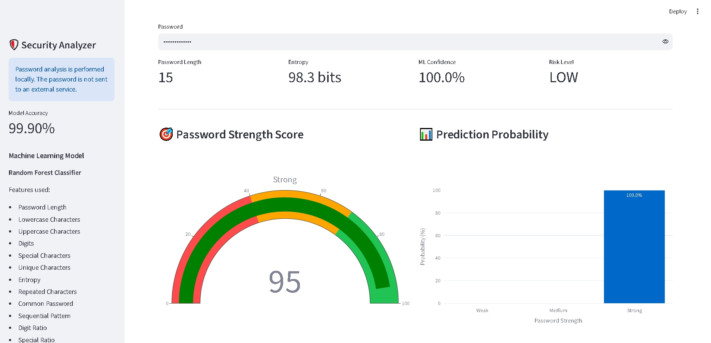
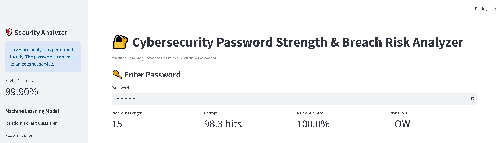
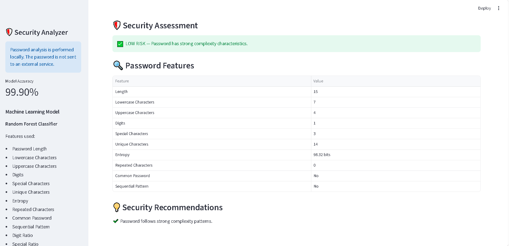

# 🔐 Cybersecurity Password Strength & Breach Risk Analyzer


## 📌 Project Overview

**Cybersecurity Password Strength & Breach Risk Analyzer** is an end-to-end Machine Learning and Streamlit-based cybersecurity application designed to analyze password strength and estimate password security risk.

The application analyzes multiple password characteristics such as length, lowercase characters, uppercase characters, digits, special characters, unique characters, entropy, repeated characters and password patterns.

A trained **Random Forest Classifier** is used to predict password strength, while the Streamlit dashboard presents the results through interactive visualizations, a password strength score, prediction probability, risk assessment and security recommendations.

---

## 🎯 Problem Statement

Weak and predictable passwords can increase the risk of unauthorized access and account compromise.

Traditional password strength checkers often rely on simple rule-based conditions. This project uses a Machine Learning approach combined with password feature engineering to provide a more detailed password security assessment.

### Project Objectives

* Analyze password characteristics
* Extract meaningful security-related features
* Predict password strength using Machine Learning
* Calculate password entropy
* Display ML prediction confidence
* Provide a visual password strength score
* Assess overall password risk
* Generate security recommendations
* Provide an interactive Streamlit dashboard

---

## ✨ Key Features

* 🔐 Password strength analysis
* 🤖 Random Forest Machine Learning classifier
* 📊 Prediction probability visualization
* 🎯 Password strength score
* 📈 ML confidence score
* 🛡️ Risk level assessment
* 🔍 Detailed password feature analysis
* 🧠 Password entropy calculation
* 🔁 Repeated character detection
* 🔤 Character diversity analysis
* 🚨 Common password detection
* 🔢 Sequential pattern detection
* 💡 Security recommendations
* 🖥️ Interactive Streamlit dashboard
* 🔒 Local password analysis

---

## 🧠 Machine Learning

### Model Used

**Random Forest Classifier**

Random Forest is an ensemble Machine Learning algorithm that combines multiple decision trees to improve classification performance and robustness.

The model is trained using engineered password-related features and predicts the password strength category.

### Model Accuracy

The current dashboard reports:

**99.90% Model Accuracy**

> Model performance should be interpreted together with other evaluation metrics such as precision, recall, F1-score and confusion matrix.

---

## 🔍 Feature Engineering

The application extracts several features from the password.

### Password Features

* Password Length
* Lowercase Characters
* Uppercase Characters
* Digits
* Special Characters
* Unique Characters
* Entropy
* Repeated Characters
* Common Password Detection
* Sequential Pattern Detection
* Digit Ratio
* Special Character Ratio

These features are processed and provided to the Machine Learning model for password strength prediction.

---

## 🔐 Password Entropy

Password entropy is used as an indicator of password unpredictability.

Higher entropy generally indicates a larger search space and greater password complexity.

The dashboard displays entropy in **bits** to provide an additional security-related metric.

---

## 🏗️ System Architecture

```text
                    ┌──────────────────────┐
                    │      User Input      │
                    │       Password       │
                    └──────────┬───────────┘
                               │
                               ▼
                    ┌──────────────────────┐
                    │   Password Analysis  │
                    └──────────┬───────────┘
                               │
                               ▼
                    ┌──────────────────────┐
                    │  Feature Engineering │
                    │                      │
                    │ • Length             │
                    │ • Lowercase          │
                    │ • Uppercase          │
                    │ • Digits             │
                    │ • Special Characters │
                    │ • Unique Characters  │
                    │ • Entropy            │
                    │ • Repeated Characters│
                    │ • Patterns           │
                    └──────────┬───────────┘
                               │
                               ▼
                    ┌──────────────────────┐
                    │ Random Forest Model   │
                    │       (.pkl)          │
                    └──────────┬───────────┘
                               │
                    ┌──────────┴──────────┐
                    │                     │
                    ▼                     ▼
          ┌─────────────────┐   ┌─────────────────┐
          │ Strength Score  │   │ Risk Assessment │
          │ & Prediction    │   │ & Probability   │
          └────────┬────────┘   └────────┬────────┘
                   │                     │
                   └──────────┬──────────┘
                              │
                              ▼
                   ┌──────────────────────┐
                   │ Streamlit Dashboard  │
                   └──────────┬───────────┘
                              │
                              ▼
                   ┌──────────────────────┐
                   │ Security Analysis &  │
                   │ Recommendations      │
                   └──────────────────────┘
```

---

## 🖥️ Streamlit Dashboard

The application provides an interactive dashboard for analyzing password security.

### Dashboard Overview

The dashboard displays:

* Password length
* Password entropy
* ML confidence
* Risk level
* Password strength score
* Prediction probability
* Detailed password features
* Security recommendations



---

## 🎯 Password Strength & Prediction

The application provides a visual password strength score and Machine Learning prediction probability.

The dashboard displays the predicted strength category along with the model confidence.



---

## 🛡️ Security Assessment

The Security Assessment section provides detailed password characteristics and security recommendations.

It helps users understand which password properties contribute to stronger password complexity.



---

## 📊 Dashboard Metrics

The dashboard provides several important metrics.

| Metric                 | Description                                 |
| ---------------------- | ------------------------------------------- |
| Password Length        | Number of characters in the password        |
| Entropy                | Estimated password unpredictability         |
| ML Confidence          | Model confidence for the prediction         |
| Risk Level             | Overall security risk assessment            |
| Strength Score         | Visual password strength score              |
| Prediction Probability | Probability associated with predicted class |

---

## 📂 Project Structure

```text
CyberSecurity_Project/
│
├── app.py
│       └── Streamlit dashboard and password analysis
│
├── train_model.py
│       └── Machine Learning model training
│
├── requirements.txt
│       └── Python dependencies
│
├── .gitignore
│       └── Files excluded from Git
│
├── data/
│       └── Dataset and data files
│
├── models/
│       └── Trained Machine Learning model
│
├── screenshots/
│       ├── dashboard-home.png
│       ├── strength-prediction.png
│       └── security-assessment.png
│
└── README.md
```

---

## 🛠️ Technology Stack

| Technology      | Purpose                   |
| --------------- | ------------------------- |
| Python          | Core programming language |
| Pandas          | Data processing           |
| NumPy           | Numerical operations      |
| Scikit-learn    | Machine Learning          |
| Matplotlib      | Visualization             |
| Seaborn         | Data visualization        |
| Streamlit       | Interactive dashboard     |
| Joblib / Pickle | Model persistence         |
| Git             | Version control           |
| GitHub          | Source code management    |

---

## ⚙️ Installation

### 1. Clone the repository

```bash
git clone https://github.com/py722309-code/CyberSecurity-Password-Strength-Analyzer.git
```

### 2. Open the project directory

```bash
cd CyberSecurity-Password-Strength-Analyzer
```

### 3. Install required Python packages

```bash
pip install -r requirements.txt
```

---

## ▶️ Run the Application

Start the Streamlit dashboard using:

```bash
python -m streamlit run app.py
```

The application will open in your default web browser.

If it does not open automatically, copy the local URL displayed in the terminal and open it manually.

---

## 🤖 Train the Machine Learning Model

To train or retrain the Machine Learning model:

```bash
python train_model.py
```

The trained model is stored inside the `models/` directory.

---

## 📈 Model Evaluation

The Machine Learning model can be evaluated using:

* Accuracy
* Precision
* Recall
* F1-score
* Confusion Matrix
* Classification Report

The current application reports a model accuracy of:

### **99.90%**

For a complete evaluation, precision, recall, F1-score and confusion matrix should also be considered.

---

## 🔒 Privacy & Security

Password analysis is designed to be performed locally within the application.

The dashboard explicitly informs users that:

> Password analysis is performed locally. The password is not sent to an external service.

Users should still avoid entering real passwords or passwords that are currently used for important accounts into demonstration applications.

---

## ⚠️ Security Disclaimer

This project is developed for **educational, research and defensive cybersecurity purposes**.

This project does **not**:

* Crack real user passwords
* Attempt to access social media accounts
* Bypass authentication systems
* Attack external systems
* Provide unauthorized account access
* Recover passwords from real accounts

The application should be used only with test or demonstration passwords.

---

## 🚀 Future Improvements

Potential future improvements include:

* Integration with reputable password breach-checking services
* Advanced password entropy analysis
* Deep Learning-based password classification
* More advanced password pattern detection
* Password security history
* REST API integration
* Cloud deployment
* Automated PDF security reports
* Advanced model evaluation dashboard
* Model explainability using SHAP
* Continuous model improvement with new datasets

---

## 🎓 Learning Outcomes

This project demonstrates practical experience in:

* Python Programming
* Data Preprocessing
* Feature Engineering
* Machine Learning
* Classification
* Random Forest
* Model Evaluation
* Data Visualization
* Streamlit Development
* Cybersecurity Concepts
* Git & GitHub
* Application Deployment

---

## 💼 Portfolio Value

This project combines:

```text
Data Science
      +
Machine Learning
      +
Python
      +
Data Visualization
      +
Streamlit
      +
Cybersecurity
      +
Git & GitHub
```

It demonstrates an end-to-end workflow from password feature engineering and Machine Learning prediction to an interactive cybersecurity dashboard.

---

## 👨‍💻 Author

### Prashant Yadav

B.Tech Computer Science & Engineering

GitHub:
https://github.com/py722309-code

---

## ⭐ Support

If you find this project useful, consider giving the repository a ⭐ on GitHub.

---

## 📜 License

This project is intended primarily for educational, research and portfolio purposes.
